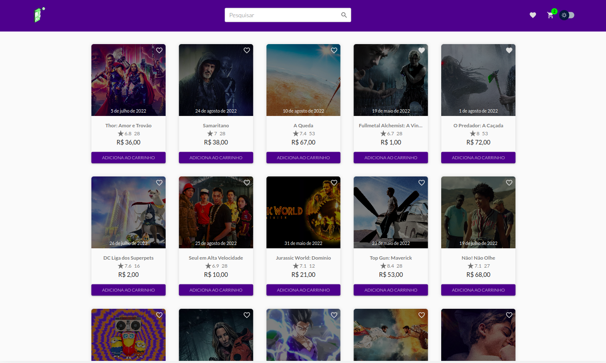
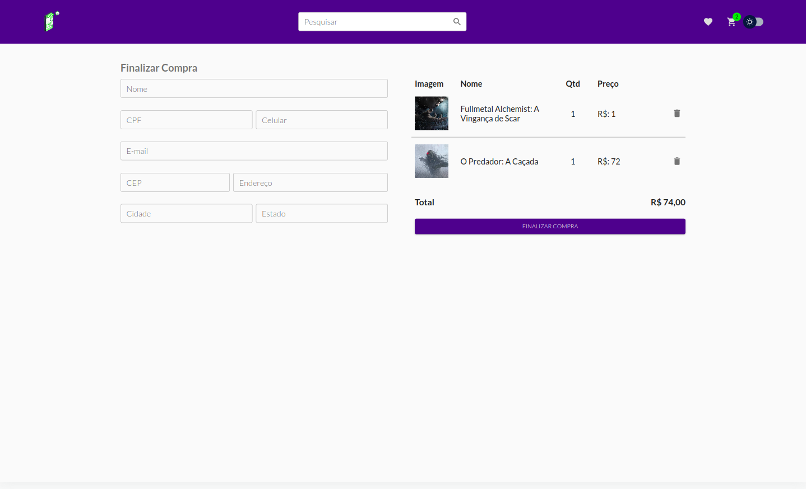

# Catalogo de Filmes

  </img>
  
DASHBORD

  </img>
  
CHECKOUT

## Tecnologias:

### TypeScript:

- [TypeScript](https://www.typescriptlang.org/)

### React.js:

- [React.js](https://reactjs.org/)

### Material-ui:

- [Material-ui](https://material-ui.com/)

### Styled-components:

- Biblioteca utilizada para a criação de estilos.

### Axios:

- Biblioteca utilizada para a requisição de dados.

## API EXTERNA:

- [TMDB](https://www.themoviedb.org/)

## LINK DO PROJETO:

- [Catalogo de Filmes](https://films-ecomerce.vercel.app/)

- Para rodar o projeto localmente, tem que acessa ao link da api acima e criar uma conta, depois pegar a chave de acesso, url da api e colocar no arquivo .env

- [Link para documentação da api](https://developers.themoviedb.org/3/getting-started/introduction)

## INICIANDO O PROJETO:

clone o projeto:

<pre>
  git clone https://github.com/devsergionunes/films-ecomerce.git
</pre>

Iniciar aplicação:

<pre>
 npm install && npm start
</pre>
